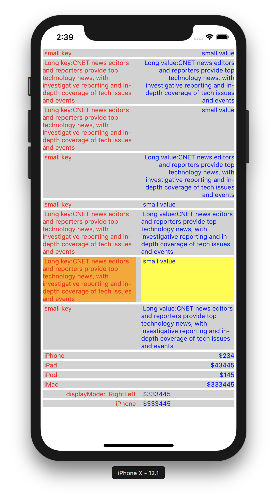

# Output

# Usage
# Global Config can be applied to the App.
*You could use the KeyValueDisplay with the same UI appearance & style in the entire App. In that case you could just use this below global config, that will apply to all KeyValueDisplay component. You could use the "isDebugging" for seeing the key,value boxes with background colors.*

    import KeyValueDisplay from 'react-native-key-value-display'

    // will apply the background color to see the key box, value box, container box. So that debugging is easy.
    KeyValueDisplay.isDebugging = true

    // Available Display Modes
    LeftRight,
    LeftLeft,
    RightLeft,
    RightRight

    // will set the default display mode 
    KeyValueDisplay.defaultDisplayMode = KeyValueDisplay.DisplayMode.LeftRight//LeftLeft//RightLeft//RightRight

    // will set the default key value gap
    KeyValueDisplay.defaultKeyValueGap = 5

    // will set the default vertical gap between 2 adjuscent KeyValueDisplay
    KeyValueDisplay.defaultSiblingGapVertical = 2

    // will set the default left right gap to KeyValueDisplay
    KeyValueDisplay.defaultSiblingGapHorizontal = 4

    // will set the default key box background color
    KeyValueDisplay.defaultKeyBoxBackgroundColor = "#d2d2d2"

    // will set the default value box background color
    KeyValueDisplay.defaultValueBoxBackgroundColor = "#d2d2d2"

    // will set the default container/gap box background color
    KeyValueDisplay.defaultKeyBoxContainerBackgroundColor = "#d2d2d2"

    // will set default styles for Key Text, should be an array
    KeyValueDisplay.defaultKeyStyles = [{ color: 'red', fontSize: 12 }]

    // will set default styles for Value Text, should be an array
    KeyValueDisplay.defaultValueStyles = [{ color: 'blue', fontSize: 12 }]

----
----     

# Key value displaying

    <KeyValueDisplay keyData="iPhone" valueData="$343"/>

    <KeyValueDisplay keyData="Email" valueData="Vijay.Apple.Dev@gmail.com"/>

    <KeyValueDisplay keyData="Phone" valueData="+91 9585185595"/>

    <KeyValueDisplay keyData="Full Stack Developer" valueData="http://fullstackdeveloper-vijay.blogspot.com"/>
    
----
# Note on Style props
*All style props should be passed in Array format, refer the below "keyStyles", to an example.*

            <KeyValueDisplay keyData="iPhone" valueData="$343" displayMode="RightLeft" keyValueGap={40} keyStyles={[{color:"red"}]}/>

# Pass My custom Key/Value component

            <KeyValueDisplay leftChild={<Text>iPhone</Text>} valueData="$343"/>

            <KeyValueDisplay keyData="iPhone" rightChild={<Text>$343</Text>}/>

*if you pass your custom component to either key or value, then you are having full control on it, like adding action, etc., Don't forget to style the "textAlign" based on your needs inside your custom component.*

# Available props

            keyBoxStyles = [],
            valueBoxStyles = [],
            keyStyles = [],
            valueStyles = [],
            keyValueBoxStyles = [],
            keyData,// Key text
            valueData, // Value text
            leftChild, // Custom key component
            rightChild, // Custom value component
            keyValueGap = KeyValueDisplay.defaultKeyValueGap,// Gap between Key & Value Boxes
            siblingGapVertical = KeyValueDisplay.defaultSiblingGapVertical//Top Bottom gap,
            siblingGapHorizontal = KeyValueDisplay.defaultSiblingGapHorizontal,// Left Right gap
            keyBoxPercent = 50,// Key box space
            valueBoxPercent = 50,// Value box space
            displayMode = KeyValueDisplay.defaultDisplayMode// Display mode "RightLeft","LeftRight",etc.,
